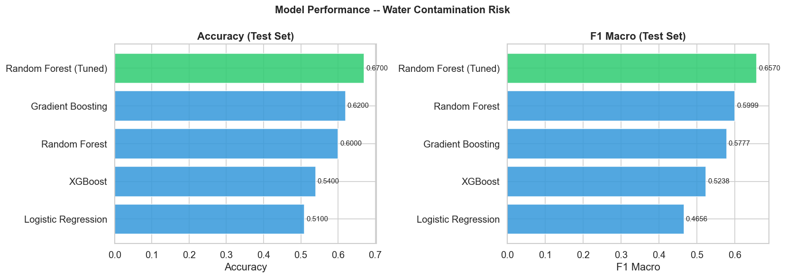
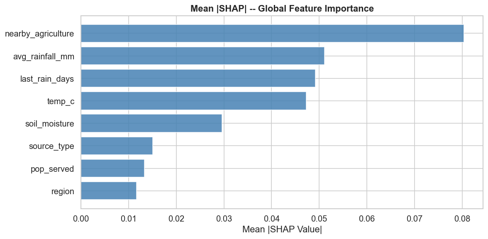
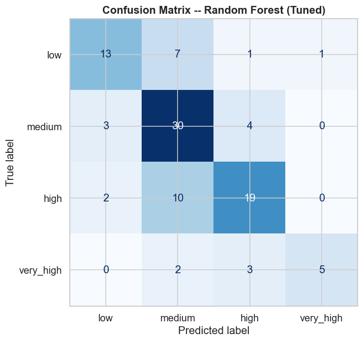

# 💧 Water Contamination Risk Prediction — Morocco
### Multi-Class Classification | SHAP Explainability | Interactive Risk Map


---

## 📌 Problem Statement

Access to safe water is a fundamental public health challenge in Morocco, particularly in rural and arid regions. Water sources, rivers, springs, wells, and shared taps, face varying contamination levels depending on environmental, geographic, and agricultural factors.

This project builds a machine learning system that predicts the **contamination risk level** of water sources from easily measurable features, enabling:

- 🎯 **Prioritized field inspections** - focus resources on highest-risk sources
- 🏥 **Early public health warnings** - alert communities before contamination spreads
- 🌍 **Regional policy decisions** - identify which regions need infrastructure investment
- 📊 **Data-driven resource allocation** - optimize limited testing budgets

> **Dataset:** Moroccan Water Sources - 100 real samples + 400 rule-based synthetic samples = 500 total  
> **Domain:** Environmental ML / Public Health  
> **Target:** Contamination risk level - 4 classes: `low` / `medium` / `high` / `very_high`

---

## 📊 Results

| Model | CV F1 Macro | Test Accuracy | Test F1 Macro |
|-------|:---:|:---:|:---:|
| Logistic Regression | 0.4449 | 0.51 | 0.4656 |
| XGBoost | 0.5079 | 0.54 | 0.5238 |
| Gradient Boosting | 0.5355 | 0.62 | 0.5777 |
| Random Forest | 0.5513 | 0.60 | 0.5999 |
| **Random Forest (Tuned)** ✅ | **0.5891** | **0.67** | **0.6570** |

**Best model: Random Forest (Tuned) - 67% accuracy, F1 Macro 0.657 on held-out test set**

### Per-Class Performance (Best Model)

| Risk Class | Precision | Recall | F1 |
|---|:---:|:---:|:---:|
| low | 0.72 | 0.59 | 0.65 |
| medium | 0.61 | 0.81 | 0.70 |
| high | 0.70 | 0.61 | 0.66 |
| very_high | 0.83 | 0.50 | 0.62 |

---

## 📈 Visualizations





---

## 🔍 SHAP Explainability - What Drives Contamination Risk?

| Rank | Feature | Mean SHAP | Interpretation |
|------|---------|:---:|---|
| 1 | **nearby_agriculture** | 0.080 | Agricultural proximity is the strongest driver, farmland runoff is the primary contamination source |
| 2 | **avg_rainfall_mm** | 0.051 | Low rainfall reduces natural dilution of contaminants |
| 3 | **last_rain_days** | 0.049 | Long dry periods allow contamination to accumulate |
| 4 | **temp_c** | 0.047 | High temperatures promote bacterial growth |
| 5 | **soil_moisture** | 0.030 | Dry soil retains fewer contaminants |
| 6 | **source_type** | 0.015 | Wells and shared taps are riskier than rivers/springs |
| 7 | **pop_served** | 0.013 | Population size has minor influence |
| 8 | **region** | 0.012 | Geographic region has least influence once other factors are accounted for |

**The top 4 features are all environmental** , this tells health authorities to prioritize monitoring during dry, hot periods in agricultural areas.

---

## 🧠 Key Technical Decisions

### ✅ Rule-Based Synthetic Data Expansion
The original dataset had only 100 rows, insufficient for reliable 4-class classification. I expanded to 500 samples using rule-based synthetic data where contamination risk follows real environmental logic:
- Low rainfall + high temperature + nearby agriculture → higher risk score
- High soil moisture + spring/river source → lower risk score

This preserves real-world feature-label relationships, unlike random label assignment.

### ✅ Smart Encoding Strategy
- **Nominal features** (region, source_type, nearby_agriculture): `LabelEncoder` , tree models handle this well
- **Ordinal feature** (soil_moisture): `OrdinalEncoder` with explicit order `[very_low → very_high]` , preserves the natural ranking
- **Stratified split**: preserves class proportions in both train and test sets

### ✅ 5-Fold Stratified Cross-Validation
All models evaluated with stratified CV before final test evaluation , ensures reliable performance estimates on imbalanced classes.

### ✅ RandomizedSearchCV Tuning
30 candidates × 5 folds = 150 fits on Random Forest:
- Best params: `n_estimators=200, max_depth=15, min_samples_split=2, min_samples_leaf=2, max_features=log2`
- CV F1 improved from 0.5513 → 0.5891 after tuning

### ✅ SHAP Explainability
Feature importance explained via SHAP values, not just model-internal importance scores, but actual contribution to each prediction across all 4 risk classes.

### ✅ Interactive Folium Map
All 100 original water sources plotted on an interactive map of Morocco, color-coded by risk level with clickable popups showing source details.

---

## 📁 Project Structure

```
water-contamination-risk-morocco/
├── Water_Contamination_Morocco_FINAL.ipynb   # Main notebook (fully executed)
├── large_water_contamination_data.csv        # Original dataset (100 rows)
├── predicted_water_sources.csv               # Model predictions on new sources
├── morocco_contamination_risk_map.html       # Interactive Folium risk map
├── morocco_regions_geojson.json              # Morocco GeoJSON data
└── plots/
    ├── 01_class_distribution.png             # Target variable distribution
    ├── 02_regional_analysis.png              # Risk by region (count + %)
    ├── 03_feature_distributions.png          # Numerical features by risk level
    ├── 04_correlation_heatmap.png            # Feature correlation matrix
    ├── 05_categorical_analysis.png           # Source type & agriculture analysis
    ├── 06_model_comparison.png               # Model benchmark bar charts
    ├── 07_confusion_matrix.png               # Best model confusion matrix
    ├── 08_shap_summary.png                   # SHAP beeswarm plot
    └── 09_shap_importance.png                # Mean SHAP feature ranking
```

---

## ⚙️ How to Run

```bash
# 1. Clone
git clone https://github.com/hananefellah/water-contamination-risk-morocco
cd water-contamination-risk-morocco

# 2. Install dependencies
pip install numpy pandas matplotlib seaborn scikit-learn xgboost shap folium

# 3. Run
jupyter notebook Water_Contamination_Morocco_FINAL.ipynb
```

---

## 🛠️ Tech Stack

| Tool | Purpose |
|------|---------|
| Python 3.12 | Core language |
| Pandas / NumPy | Data manipulation |
| Scikit-learn | ML models, preprocessing, CV, tuning |
| XGBoost | Gradient boosting model |
| SHAP | Model explainability |
| Folium | Interactive geographic map |
| Matplotlib / Seaborn | Visualization |

---

## ⚠️ Limitations

- Dataset expanded with rule-based synthetic data - real-world validation on fresh data is needed before deployment
- 67% accuracy on 4 classes leaves room for improvement with richer chemical features (pH, nitrates, bacteria counts)
- `very_high` class has only 48 samples - recall of 50% on this class is the main area for improvement


---
## 📄 License

MIT License


## 👩‍💻 Author

**Fellah Hanane** — Data Scientist  
🌐 [GitHub](https://github.com/hananefellah) 
📧 Email: hananefellah35@gmail.com
· Open to Remote Roles
